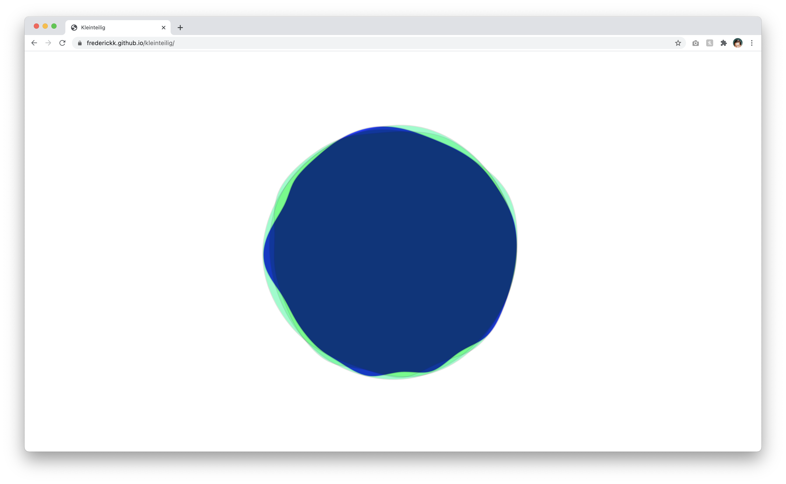

Kleinteilig
===

## Generative visuals for OP-Z (or any MIDI device) over USB or BLE.

## [frederickk.github.io/kleinteilig](https://frederickk.github.io/kleinteilig/)

[](https://frederickk.github.io/kleinteilig/)


---
### Dependencies

- [Web MIDI](https://www.w3.org/TR/webmidi/)
- [Web Bluetooth](https://webbluetoothcg.github.io/web-bluetooth/)
- [paper.js](http://paperjs.org/reference/path/#bringtofront)
- [OPZ.js](https://github.com/nbw/opz)

---
### References

- [segmented square](http://sketch.paperjs.org/#V/0.12.7/S/jVNNb8IwDP0rVi+kgpUybRc6DtPOk6axG6AptKaNKAlrUpCG+t/npPSDfYhd2tR+9nt+Tk+e5Dv0pt58iybOvJEXq8R+52hgz032DjOQeIQXOgevGBsu0xyZDXVfSwk1SAlpWDiC0B81sbn4RHYfUpAe/lL6frSUrnOgTaG2+KRyVRDLYJ3zeDtokmtVykQHMUqDNn0QeLwMUp+ljJXUBjSmBHm2GmMUOatb5ChTk8EYbu98Bx6PYUNczA4nqCCM6PUAfTRFhkMfTg4McOCFS/dcYKee7mkju7IMrsTCA54kZxEpGmfLo2HCb0EkgyW1goQUkH57GM5g0nEDiA0wAUMH6YvsY86EuZD4pn7htOUdL0AFcD5XfcHnmfjebkJ/lLzAQfQLoFlWgUmbF1a4XcENTOpYdbGaHa1LU9FiRdn/LwDa2mBf6uwvP6+aedXJ2sZrZK2RrYvOwm58SvXm/n5rmvbN9f95+0vnuMvFudJoRzJFie7q1noK3KkDMj+iH3VdIN/urTrtTRer6gs=)
- [MIDI Message Viewer](https://qiita.com/ryoyakawai/items/200b3b05d8bd0096f68d)

---
### Develop

```
$ npm run dev
```

Build

```
$ npm run build
```

Deploy

```
$ npm run deploy
```
